# Uçuş ve Pilot Yönetim Sistemi — UML Sınıf Diyagramı

Bu doküman, bir hava yolu şirketinin uçuş ve pilot yönetimini modelleyen UML sınıf diyagramını açıklamaktadır.

---

## Sınıflar

### HavaYoluSirketi
Sistemin merkezinde yer alan ana sınıftır. Her hava yolu şirketinin benzersiz bir kimliği (`id`) ve adı (`ad`) vardır. Şirkete ait uçakları ve pilotları composition ilişkisiyle bünyesinde barındırır; şirket olmadan bu varlıklar da var olamaz.

### UcakTipi
Uçakların hangi tipte olduğunu tanımlar. Her tip için gerekli minimum pilot sayısı (`gerekliPilotSayisi`) bu sınıfta tutulur. Bir uçak tipi birden fazla uçakla ilişkilendirilebilir (1 — *).

### Ucak
Hava yolu şirketine ait fiziksel uçağı temsil eder. Her uçağın benzersiz bir kimliği (`id`) ve anlık durumu (`durum`) vardır. Durum, `{calisir, onarim}` enum değerlerinden birini alır. Her uçak bir `UcakTipi` ile ilişkilidir.

### Pilot
Hava yolu şirketinde görev yapan pilotu temsil eder. Her pilotun benzersiz bir kimliği (`id`) ve deneyim seviyesi (`deneyimSeviyesi`) bulunur. Bir pilot, bir uçuşta komutan pilot ya da yardımcı pilot rolünü üstlenebilir.

### Ucus
Gerçekleştirilen ya da planlanmış her uçuşu temsil eder. Aşağıdaki nitelikleri taşır:

| Nitelik | Tür | Açıklama |
|---|---|---|
| `ucusId` | String | Benzersiz uçuş kimliği |
| `kalkisHavaalani` | Havaalani | Kalkışın yapıldığı havaalanı |
| `inisHavaalani` | Havaalani | İnişin yapıldığı havaalanı |
| `kalkisSaati` | DateTime | Planlanan kalkış zamanı |
| `inisSaati` | DateTime | Planlanan iniş zamanı |

Her uçuşun bir pilotu ve bir yardımcı pilotu bulunur; her ikisi de `Pilot` sınıfına referans verir.

### Havaalani
Kalkış ve iniş noktalarını temsil eder. Her havaalanının benzersiz bir kimliği (`id`) ve ismi (`isim`) vardır. Bir uçuş, kalkış ve iniş için iki farklı havaalanına bağlıdır (çokluk: 2).

---

## İlişkiler

| İlişki | Tip | Çokluk | Açıklama |
|---|---|---|---|
| HavaYoluSirketi → Ucak | Composition | 1 — * | Şirkete ait uçaklar |
| HavaYoluSirketi → Pilot | Composition | 1 — * | Şirkete ait pilotlar |
| HavaYoluSirketi → Ucus | Association | 1 — * | Şirketin gerçekleştirdiği uçuşlar |
| UcakTipi → Ucak | Association | 1 — * | Bir tipteki uçaklar |
| Ucus → Ucak | Association | * — 1 | Her uçuş bir uçakla yapılır |
| Ucus → Pilot | Association | * — 1 | Her uçuşun pilotu ve yardımcı pilotu |
| Ucus → Havaalani | Association | * — 2 | Kalkış ve iniş havaalanları |

---

## Tasarım Kararları

**Composition vs Association:** `HavaYoluSirketi` ile `Ucak` ve `Pilot` arasında composition tercih edildi. Bir şirket kapandığında ona ait uçaklar ve pilot kadrosu da anlamsız hale gelir. Buna karşın `Havaalani`, şirketten bağımsız var olabileceği için association ile modellendi.

**UcakTipi ayrı sınıf olarak modellendi** çünkü gerekli pilot sayısı tipe göre değişir ve bu kural iş mantığının bir parçasıdır. Tip bilgisi doğrudan `Ucak` içine gömülseydi, aynı verinin birden fazla uçak nesnesinde tekrarlanması gerekirdi.

**Pilot rolü:** Bir uçuşta komutan pilot ve yardımcı pilot ayrımı, `Ucus` sınıfındaki iki ayrı `Pilot` referansıyla (`pilot`, `yardimciPilot`) ifade edilir. Her ikisi de aynı `Pilot` sınıfına bağlıdır.

**Uçak durumu enum olarak modellendi:** `{calisir, onarim}` değerleri sabit ve kapalı bir küme oluşturduğundan enum kullanımı uygundur. Yeni durum eklenirse enum genişletilebilir.
